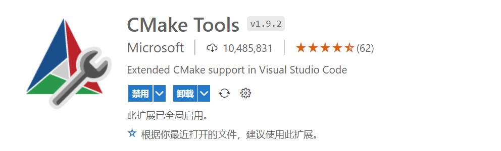

环境依赖
操作系统：Windows
MingGW工具集
Cmake
文本编辑器：VsCode

推荐为你的vscode安装下载以下插件  

为CMakeLists.txt文件的攥写提供代码补全
  

微软提供的功能扩展，一键生成模板等


在这个简单的多文件编译链接的例子里，看看如何使用cmake
```
//main.c
#include <stdio.h>
#include "fun.h"

int main(int argc,char *argv[])
{
    int a = 20;
    int b = 30;
    swap(&a,&b);
    printf("a=%d\n",a);
    printf("b=%d\n",b);
    return 0;
}
```

```
fun.c
#include "fun.h"
void swap(int* a,int* b)
{
    int temp = *a;
    *a = *b;
    *b = temp;
}
```

```
//fun.h
void swap(int* a,int* b);
```

先配置一个最基本最简单的CMakeLists.txt文件
```
project(myPro)

add_executable(myPro main.c fun.c)
```

第一行为该工程指定一个名字
第二行第一个是生成的可执行文件的文件名 后面跟随所有依赖的源文件

配置好后在你的工程目录下打开你的命令终端

输入指令：
```
cmake .
```

第一个参数.代表当前路径，这个指令将会读取当前路径的CMakeLists.txt并据此生成makefile

键入指令：
```
mingw32-make.exe
cmake --build .
//以上指令二选一
```
这个指令对应的可执行文件位于你的mingw64/bin文件夹中，
可以依据生成的makefile对工程下的源文件编译、链接成可执行文件

```
./myPro.exe
```
最后在终端执行可执行文件

这是通过命令行调用cmake为一个简单工程生成可执行文件的过程
下面我们希望通过绑定VsCode的调试功能，自动完成上面的全部步骤

我们需要配置launch.json和tasks.json

```
{
    // 使用 IntelliSense 了解相关属性。 
    // 悬停以查看现有属性的描述。
    // 欲了解更多信息，请访问: https://go.microsoft.com/fwlink/?linkid=830387
    "version": "0.2.0",
    "configurations": [
        {
            "name": "gcc.exe - build active file",
            "type": "cppdbg",
            "request": "launch",
            "program": "${workspaceFolder}\\build\\MyPro.exe",
            "args": [],
            "stopAtEntry": false,
            "cwd": "${fileDirname}",
            "environment": [],
            "externalConsole": false,
            "MIMode": "gdb",
            "miDebuggerPath": "D:\\Coding\\mingw64\\bin\\gdb.exe",
            "setupCommands": [
                {
                    "description": "为 gdb 启用整齐打印",
                    "text": "-enable-pretty-printing",
                    "ignoreFailures": true
                }
            ],
            "preLaunchTask": "Build"
        }
    ]
}
```

